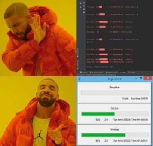
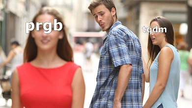

## Prgb-pkg

_**(Despite the current project version is 0.x, full functionality of package is already implemented.
There is a need to check if there are exceptional cases in which package content do not work correctly.
After that, the version of package will be fixed and upgraded to 1.0 marking the stable release.)**_

_Prgb-pkg_ is a Python package containing wrapper class for iterable objects.   
The main reason of its creation, is to provide comfortable and intact tracking of progress
in python `for` loops, like in _tqdm_.  
Thanks to output information being put in dedicated GUI the console output is undisturbed and  
kept clean even when you print out information during iterating.
There is a possibility to use wrapper class in already wrapped loop.  
Input iterable object does not have to be `Sized`, but if it is the case
some progress information can not be obtained.  
Package does not use any dependiences.

[PyPI website](https://pypi.org/project/prgb-pkg/)  
[Git project homepage](https://github.com/KodenejmBerni/prgb_pkg)  





Pip installation:
```
>pip install prgb-pkg
```

Import method:
```
from prgb_pkg import Prgb  
```

Example of wrapper class usage:
```
for i in Prgb(iterable):
    ...
```

Wrapper usage on nested loop:
```
a = [3, 4, 5]

for elem in Prgb(a):
    print(elem)
    for i in Prgb(range(3)):
        print(elem ** i)
```

Each wrapper can have an optional title and can be set to not display his progress in GUI:
```
Prgb(iterable, 'Some hilarious and creative title')

Prgb(iterable, display_bar=False)
```